# SELF Emergent Properties Map

**Visual system map showing components, interactions, feedback loops, and emergent properties**

---

## System Architecture Overview

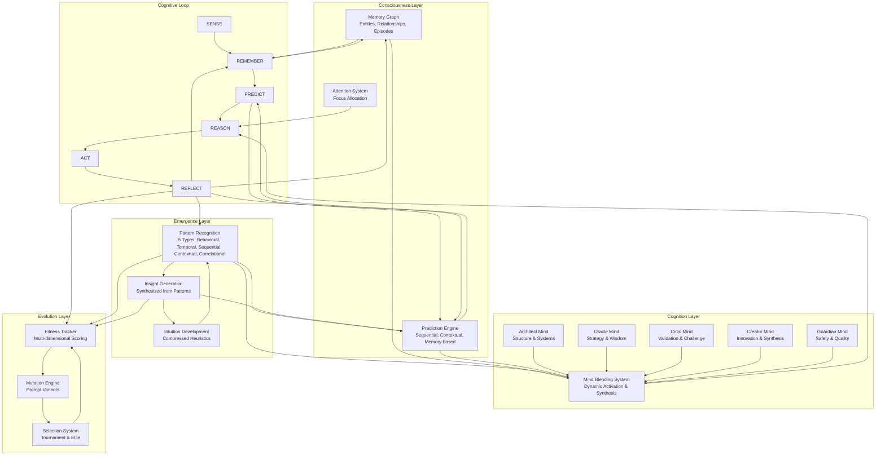

---

## Feedback Loops

```mermaid
graph LR
    subgraph LearningLoop["Learning Loop"]
        R1[Reflect] --> UM[Update Memory]
        UM --> IP[Improve Predictions]
        IP --> BR[Better Responses]
        BR --> BO[Better Outcomes]
        BO --> R1
    end
    
    subgraph EvolutionLoop["Evolution Loop"]
        F1[Fitness] --> M1[Mutation]
        M1 --> S1[Selection]
        S1 --> BP[Better Prompts]
        BP --> BPerf[Better Performance]
        BPerf --> F1
    end
    
    subgraph EmergenceLoop["Emergence Loop"]
        P1[Patterns] --> I1[Insights]
        I1 --> Int1[Intuitions]
        Int1 --> BPR[Better Pattern Recognition]
        BPR --> P1
    end
    
    subgraph ConfidenceLoop["Confidence Loop"]
        O1[Outcomes] --> Cal[Calibration]
        Cal --> AL[Autonomy Level]
        AL --> AQ[Action Quality]
        AQ --> O1
    end
    
    subgraph BlendLoop["Mind Blend Loop"]
        C1[Context] --> AW[Activation Weights]
        AW --> Resp[Response]
        Resp --> CU[Context Update]
        CU --> C1
    end
    
    subgraph SymbioticLoop["Symbiotic Loop"]
        UB[User Behavior] --> SL[System Learning]
        SL --> BA[Better Assistance]
        BA --> UA[User Adaptation]
        UA --> UB
    end
```

---

## Cross-Layer Interactions

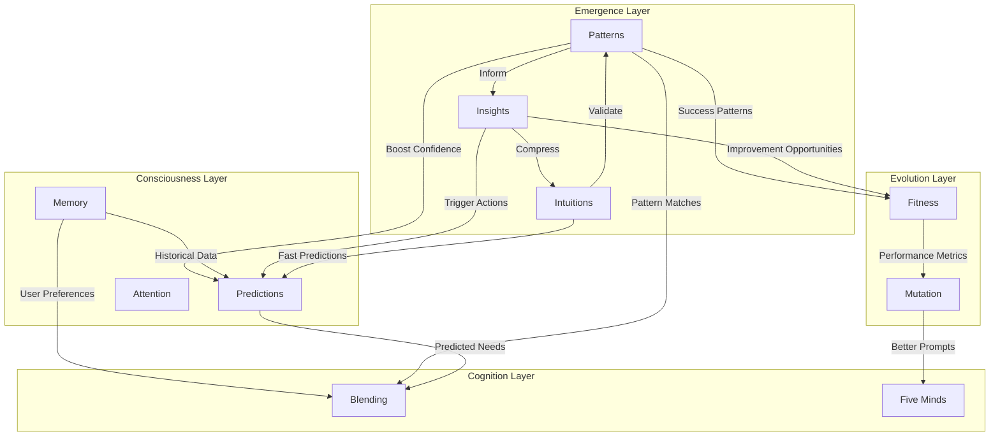

---

## Emergent Properties Map

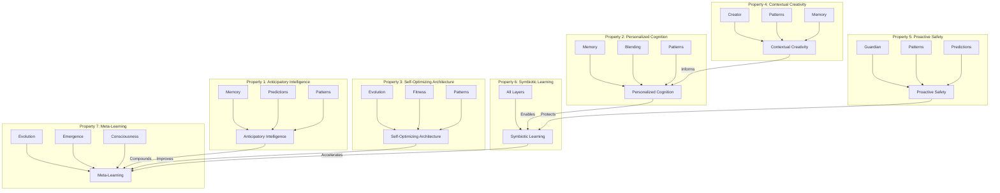

---

## Property Interaction Network

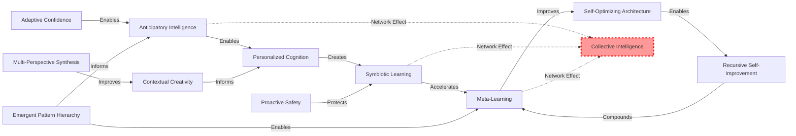

---

## Data Flow Through Cognitive Loop

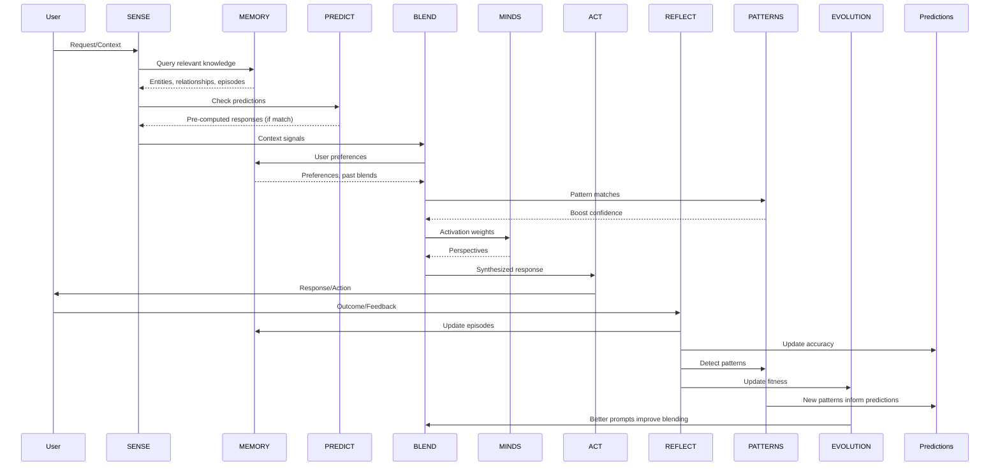

---

## Feedback Loop Strengths and Interactions

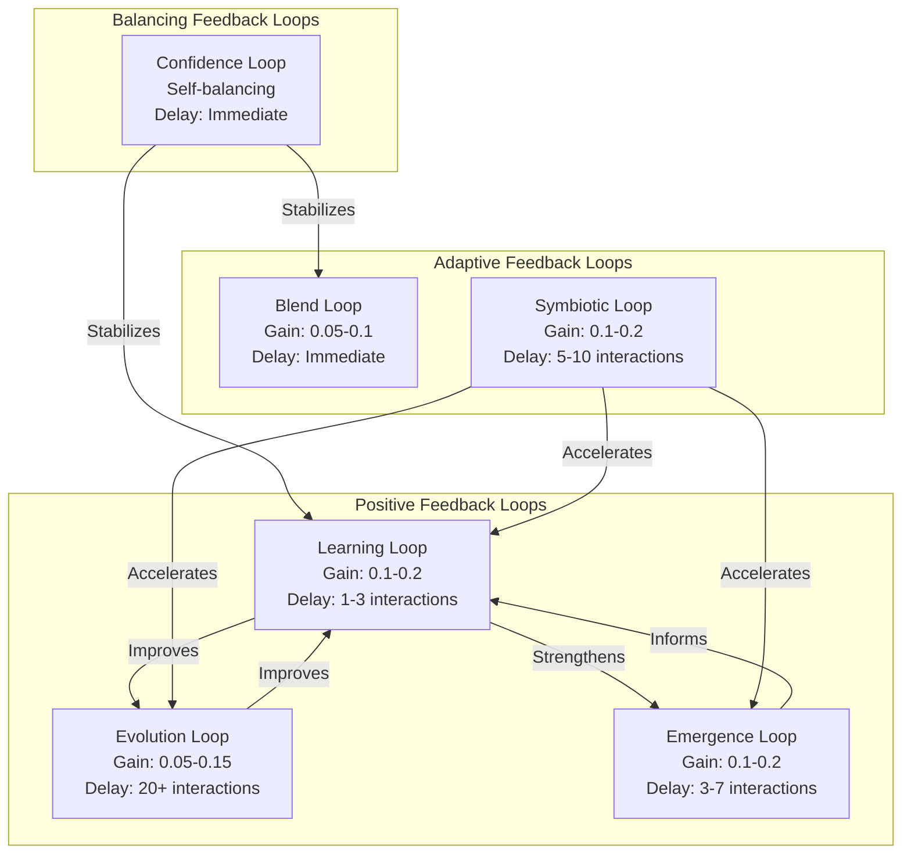

---

## Destruction Analysis Map

```mermaid
graph TD
    subgraph Structural["Structural Destruction"]
        RFB[Remove Feedback Loops] -->|"Loss of Learning"| Failure1[Static System]
        SDB[Static Mind Blending] -->|"Loss of Context"| Failure2[No Adaptation]
        LMP[Loss of Memory Persistence] -->|"Loss of Personalization"| Failure3[Generic System]
        DEU[Disconnected Evolution] -->|"Evolution Drift"| Failure4[Degraded System]
        PRWA[Pattern Recognition Without Action] -->|"No Impact"| Failure5[Ineffective System]
    end
    
    subgraph Functional["Functional Destruction"]
        BCL[Break Cognitive Loop] -->|"No Learning"| Failure6[Static System]
        SL[Separate Layers] -->|"No Emergence"| Failure7[Explicit Functions Only]
        RCC[Remove Confidence Calibration] -->|"No Autonomy"| Failure8[Always Asks Permission]
        DE[Disable Evolution] -->|"No Improvement"| Failure9[Initial State Forever]
        EPR[Eliminate Pattern Recognition] -->|"No Prediction"| Failure10[Reactive Only]
    end
    
    subgraph EdgeCases["Edge Cases"]
        MLG[Memory.json Grows Too Large] -->|"Context Exhaustion"| Failure11[System Breaks]
        PS[Patterns Become Stale] -->|"Wrong Predictions"| Failure12[User Frustration]
        HEM[Harmful Evolution Mutations] -->|"Safety Failure"| Failure13[System Violates Principles]
        BC[Blending Too Complex] -->|"Performance Degradation"| Failure14[Poor UX]
        UBC[User Behavior Changes] -->|"Adaptation Failure"| Failure15[Wrong Patterns]
    end
    
    Failure1 --> SystemFailure[System Loses Emergent Properties]
    Failure2 --> SystemFailure
    Failure3 --> SystemFailure
    Failure4 --> SystemFailure
    Failure5 --> SystemFailure
    Failure6 --> SystemFailure
    Failure7 --> SystemFailure
    Failure8 --> SystemFailure
    Failure9 --> SystemFailure
    Failure10 --> SystemFailure
    Failure11 --> SystemFailure
    Failure12 --> SystemFailure
    Failure13 --> SystemFailure
    Failure14 --> SystemFailure
    Failure15 --> SystemFailure
```

---

## Amplification Strategies Map

```mermaid
graph TB
    subgraph Strategy1["Cross-Layer Information Flow"]
        EDC[Explicit Data Channels] -->|"Reduces Loss"| Amplify1[Stronger Emergence]
        SCO[Shared Context Objects] -->|"Better Coordination"| Amplify1
        BIF[Bidirectional Flow] -->|"Reverse Learning"| Amplify1
    end
    
    subgraph Strategy2["Faster Feedback Cycles"]
        RLL[Reduce Learning Latency] -->|"Faster Adaptation"| Amplify2[Quicker Improvement]
        RTPD[Real-Time Pattern Detection] -->|"Immediate Updates"| Amplify2
        ICU[Immediate Confidence Updates] -->|"Better Autonomy"| Amplify2
        SE[Shorter Evolution] -->|"Faster Optimization"| Amplify2
    end
    
    subgraph Strategy3["Richer Pattern Recognition"]
        MSPD[Multi-Scale Patterns] -->|"Deeper Understanding"| Amplify3[Better Predictions]
        CDPM[Cross-Domain Patterns] -->|"Broader Application"| Amplify3
        TPR[Temporal Patterns] -->|"Time Awareness"| Amplify3
        MPD[Meta-Pattern Discovery] -->|"Patterns of Patterns"| Amplify3
    end
    
    subgraph Strategy4["Deeper Memory Connections"]
        IRD[Increase Relationship Depth] -->|"Multi-Hop Reasoning"| Amplify4[Better Context]
        MHR[Multi-Hop Reasoning] -->|"Indirect Connections"| Amplify4
        MCH[Memory Clusters & Hierarchies] -->|"Better Organization"| Amplify4
        MCS[Memory Compression] -->|"Efficiency"| Amplify4
    end
    
    subgraph Strategy5["Sophisticated Blending"]
        LOB[Learn Optimal Blends] -->|"Better Selection"| Amplify5[Improved Responses]
        BE[Blend Evolution] -->|"Adaptive Blending"| Amplify5
        BH[Blend Hierarchies] -->|"Nested Modes"| Amplify5
        BP[Blend Prediction] -->|"Pre-Computation"| Amplify5
    end
    
    Amplify1 --> Compound[Compound Effects]
    Amplify2 --> Compound
    Amplify3 --> Compound
    Amplify4 --> Compound
    Amplify5 --> Compound
    
    Compound --> Exponential[Exponential Growth]
```

---

## Future Timeline: Property Evolution

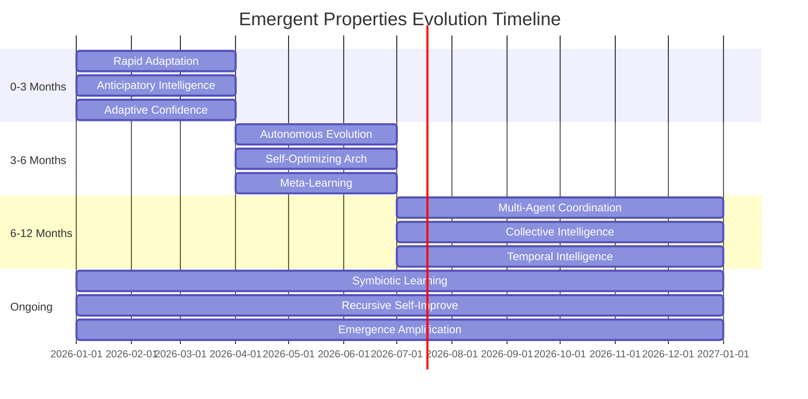

---

## Property Compound Effects

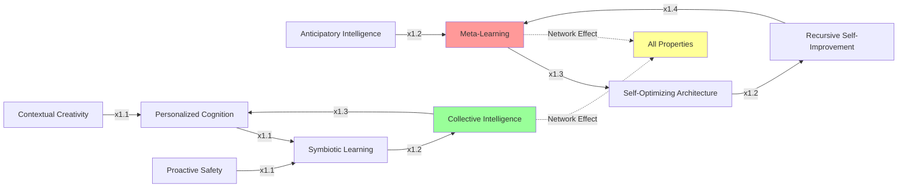

---

## Leverage Points

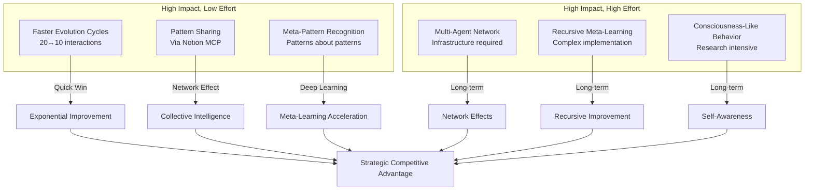

---

**Map Complete**  
**Diagrams:** 12 mermaid diagrams covering architecture, loops, interactions, properties, destruction, amplification, and strategy

